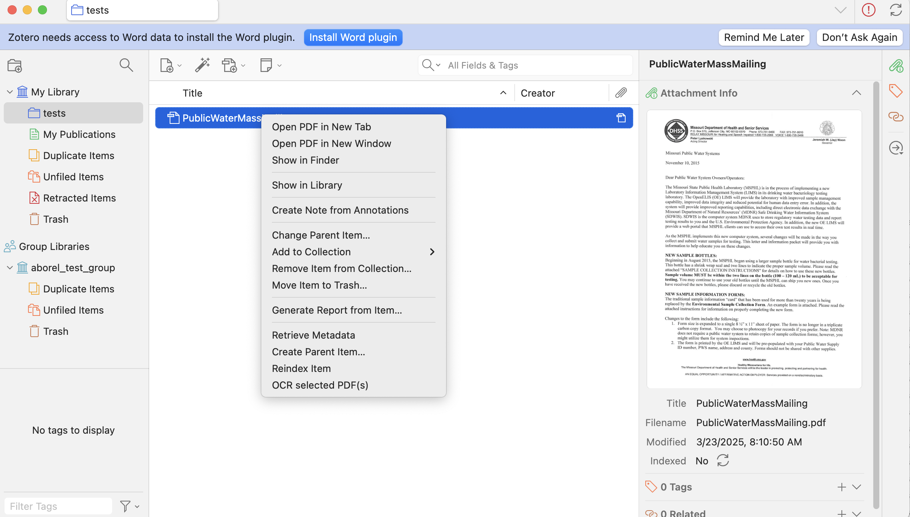
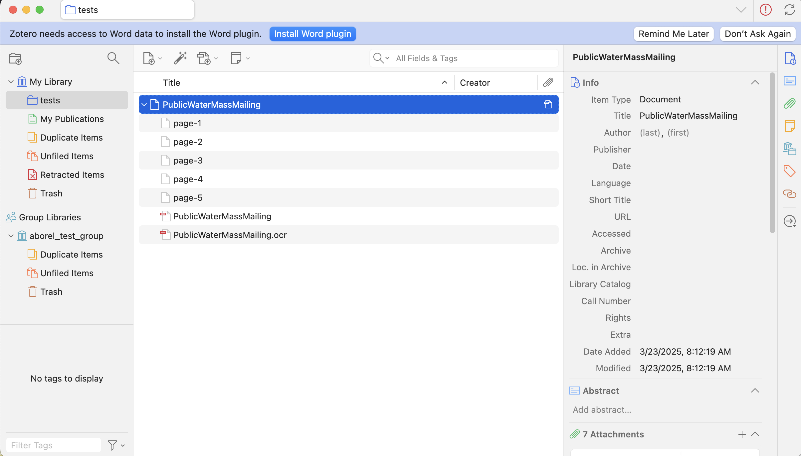

# Zotero OCR

This Zotero plugin adds the functionality to perform an OCR for the PDFs selected in Zotero.
It can add a new PDF including the recognized text, a note with the recognized text only, and HTML (hOCR) file(s).
Tesseract OCR is used for the text recognition itself.

## Prerequisites

- Tesseract OCR is installed
  - for Windows see https://github.com/UB-Mannheim/tesseract/wiki
  - for Linux, Mac see https://tesseract-ocr.github.io/tessdoc/Installation.html
- `pdftoppm` from the Poppler tools is installed
  - some hints for the installation: https://github.com/UB-Mannheim/zotero-ocr/wiki/Install-pdftoppm

Zotero must be installed using one of the officially supported methods https://www.zotero.org/support/installation#how_do_i_install_zotero. Flatpak/Snap/Appimage and similar set-ups are not supported: Zotero-OCR will not work with them in general, as such architectures prevent it from accessing the tesseract and pdftoppm tools. Skilled users might get them to work on their own machines but we cannot help with that.

## Installation

To install the extension:

1. Download the XPI file of the [latest release](https://github.com/UB-Mannheim/zotero-ocr/releases).
2. Install the XPI depending on your Zotero version:

#### Zotero 7 users
* In Zotero, go to Tools → Plugins and drag the .xpi onto the Plugins Manager window.
* Possibly, adjust the paths to Tesseract and pdftoppm in the Zotero OCR section of the Zotero settings.

#### Zotero 6 users

* In Zotero, go to Tools → Add-ons and drag the .xpi onto the Add-ons window.
* Possibly, adjust the paths to Tesseract and pdftoppm in the add-on options.
* Restart Zotero to activate Zotero OCR.

Zotero 7 was officially released in August 2024, with important changes over Zotero 6. Support for version 6 will stop at some point in the near future, please consider upgrading.

## Configuration

The configuration can be accessed under under Zotero → Settings (Zotero 7) or Tools → Zotero OCR Preferences (Zotero 6).

By default the fields for the paths to the OCR engine and pdftoppm are empty, which means that the usual locations are looked at. If that does not work, then you should locate the tools on your local machine and enter the full paths including the name of the tools itself.

The default language/script to use with Tesseract, can only be one of the installed models. If you leave that field empty, then the English model (eng) will be used, which is always installed with Tesseract.

The user may:
* modify the output DPI (by default: 300)
* modify the Tesseract Page Segmentation Mode (PSM). There are many PSM options one may want to utilize when running Tesseract (see https://tesseract-ocr.github.io/tessdoc/ImproveQuality.html)
* choose to add the new PDFs as normal attachments or as linked files. Starting with Zotero-OCR 0.8.0, the default is normal attachments, due to some drawbacks with linked files (not possible in group libraries, unwanted files remaining when a user moves attachments to the Trash...).

Moreover, these options are saved as Zotero preferences variables, which are also available through the [Config Editor](https://www.zotero.org/support/preferences/advanced).

## Zotero OCR for beginners

You can start Zotero OCR using the context menu for your PDF in Zotero:

The plugin will take some to process your PDF (one single page can take several seconds), be patient. If your PDF didn't have a parent item (https://www.zotero.org/support/kb/library_items), Zotero OCR will immeditately create one to ensure that its output file will be clearly associated with your PDF. The parent item is where you can enter proper metadata for your PDF, which will facilitate proper Zotero citations if you need them.

After processing, Zotero OCR will attach its output files to the parent item. Using the default settings, you will obtain:
* HTML attachments for the first 5 pages of the PDF (listed as page-1, page-2, etc.). This is mostly useful to verify that tesseract has been executed properly.
* A copy of your original PDF with `.ocr` added to the name. This is the final output.

The defaut Zotero OCR settings are intended to facilitate troubleshooting, and you might prefer to save some space. When you feel confident that everything is working, you may change your Zotero OCR settings to produce fewer intermediate files and attachments:
* HTML/hocr files and intermediate images can be unselected without any risk.
* Overwriting the initial PDF with the output can be convenient, in particular it will usually ensure that the attachment with a text layer will be the main one for your Zotero reference. However, you might lose your PDF if something goes wrong (possible, even if unlikely) - caution is advised.

## Development, build and release

Regular users do not need to read this section.

After any code changes one can build a new extension file by `./build.sh <version>`.
Then in Zotero install the newly created `.xpi`-file. as described in the Installation section.

If any error occurs then you will see more details in the `Help`, `Report Error...` dialog. For some debugging messages you can activate in Zotero the debugging in the `Help`, `Debug Output Logging`.

For a new release, run the script `release.sh`.
It runs the `build.sh` script, commits the code changes for the new release and adds a tag.
Push the updated local master branch and the tag to GitHub.
Then publish a [new release on GitHub](https://github.com/UB-Mannheim/zotero-ocr/releases/new) and attach the `.xpi` file there.

## License

Zotero OCR is free and Open Source software.
The source code is released under [GNU Affero General Public License v3](LICENSE).
