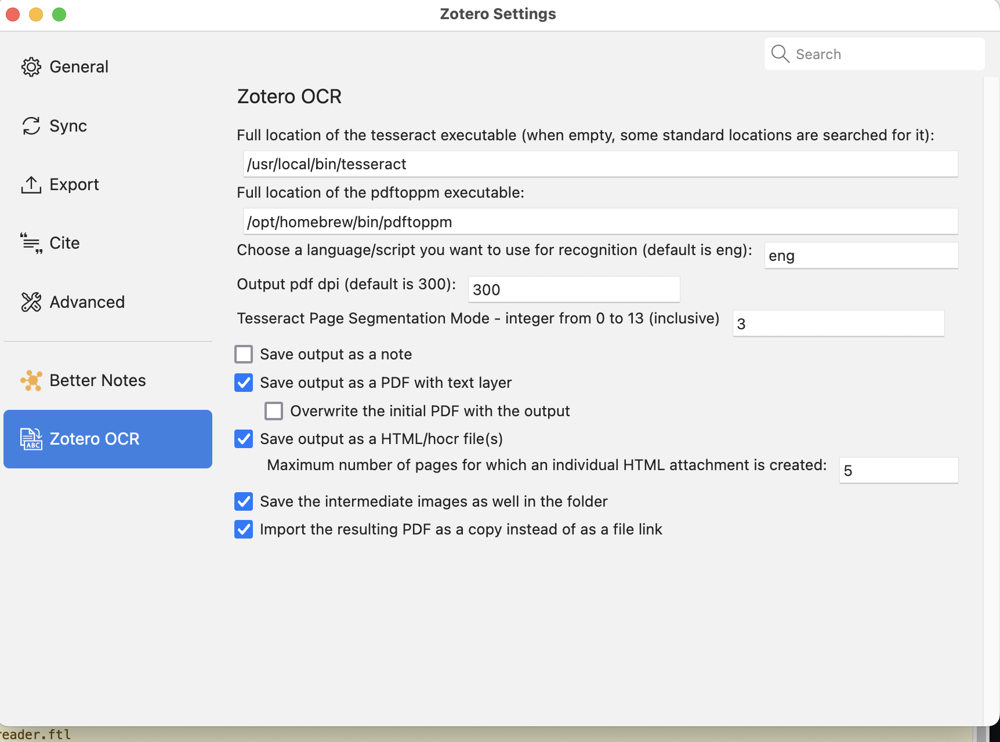

# Zotero OCR

This Zotero plugin adds the functionality to perform an OCR for the PDFs selected in Zotero.
It can add a new PDF including the recognized text, a note with the recognized text only, and HTML (hOCR) file(s).
Tesseract OCR is used for the text recognition itself.

## Prerequisites

- Tesseract OCR is installed
  - for Windows see https://github.com/UB-Mannheim/tesseract/wiki
  - for Linux, Mac see https://tesseract-ocr.github.io/tessdoc/Installation.html
- `pdftoppm` from the Poppler tools is installed
  - some hints for the installation: https://github.com/UB-Mannheim/zotero-ocr/wiki/Install-pdftoppm

Zotero must be installed using one of the officially supported methods https://www.zotero.org/support/installation#how_do_i_install_zotero. Flatpak/Snap/Appimage and similar set-ups are not supported: Zotero-OCR will not work with them in general, as such architectures prevent it from accessing the tesseract and pdftoppm tools. Skilled users might get them to work on their own machines but we cannot help with that.

## Installation

To install the extension:

* Download the XPI file of the [latest release](https://github.com/UB-Mannheim/zotero-ocr/releases).
* In Zotero, go to Tools → Add-ons and drag the .xpi onto the Add-ons window.
* Possibly, adjust the path to Tesseract in the add-on options.

## Configuration

The configuration can be accessed under Tools → Zotero OCR Preferences (Zotero 6)
or under Zotero → Settings (Zotero 7).

By default the fields for the paths to the OCR engine and pdftoppm are empty, which means, that the usual locations are looked at. If that does not work, then you should locate the tools on your local machine and enter the full paths including the name of the tools itself.

The default language/script to use with Tesseract, can only be one of the installed models. If you leave that field empty, then the English model (eng) will be used, which is always installed with Tesseract.

The user may:
- modify the output DPI (by default: 300)
- modify the Tesseract Page Segmentation Mode (PSM). There are many PSM options one may want to utilize when running Tesseract (see https://tesseract-ocr.github.io/tessdoc/ImproveQuality.html)
- choose to add the new PDFs as normal attachments or as linked files. Starting with Zotero-OCR 0.8.0, the default is normal attachments, due to some drawbacks with linked files (not possible in group libraries, unwanted files remaining when a user moves attachments to the Trash...).

Moreover, these options are saved as Zotero preferences variables, which are also available through the [Config Editor](https://www.zotero.org/support/preferences/advanced).

## Build and release

Run `build.sh` script, which creates a new `.xpi` file.

For a new release, run the script `release.sh`.
It runs the `build.sh` script, commits the code changes for the new release and adds a tag.
Push the updated local master branch and the tag to GitHub.
Then publish a [new release on GitHub](https://github.com/UB-Mannheim/zotero-ocr/releases/new) and attach the `.xpi` file there.

## Development

After any code changes one can build a new extension file by `./build.sh <version>`.
Then in Zotero go to `Tools`, `Add-ons`, `Install Add-on From File...`
and choose there the newly created `.xpi`-file.
Zotero 6 will restart with the newly built add-on version.
Zotero 7 does not require a restart and will activate it immediately.

If any error occurs then you will see more details in the `Help`, `Report Error...` dialog. For some debugging messages you can activate in Zotero the debugging in the `Help`, `Debug Output Logging`.

## License

Zotero OCR is free and Open Source software.
The source code is released under [GNU Affero General Public License v3](LICENSE).
